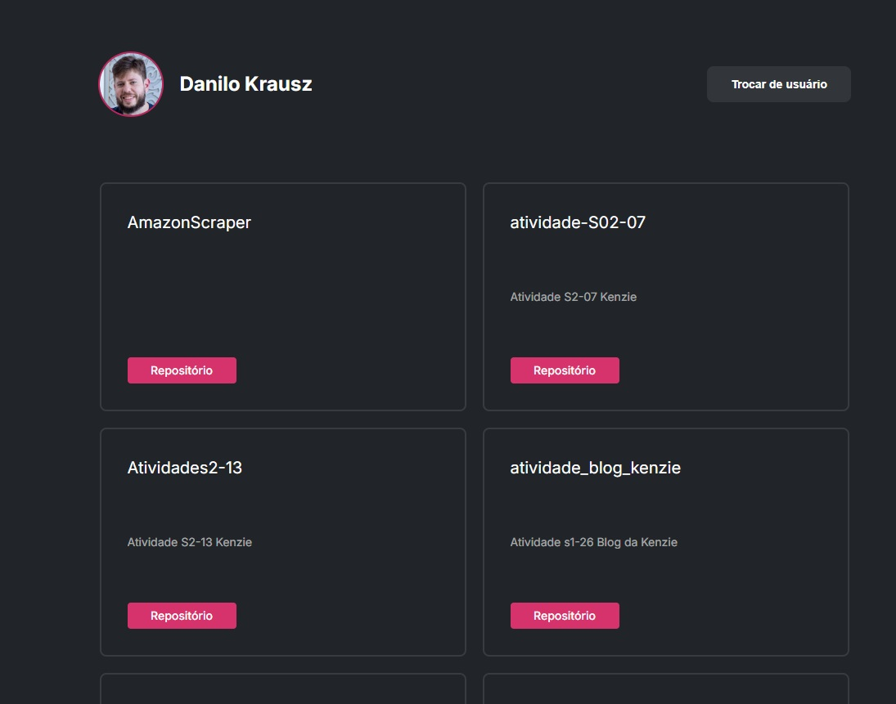

# 🔎 Projeto: GitHub User Search

Este projeto foi desenvolvido como parte do curso da Kenzie Academy. O objetivo é consumir a [GitHub API](https://docs.github.com/pt/rest) para buscar por usuários da plataforma e exibir seus repositórios públicos. A aplicação também implementa navegação entre páginas para lidar com diferentes estados da busca (usuário encontrado ou não encontrado).

---

## 📋 Descrição

A aplicação permite:

- Procurar um usuário do GitHub por meio de um campo de busca;
- Exibir a lista de repositórios públicos do usuário caso ele seja encontrado;
- Redirecionar para uma página de erro (404) caso o usuário não exista.

Informações exibidas na tela de resultado:

- Avatar do usuário;
- Nome de usuário (username);
- Nome do repositório;
- Descrição;
- Link direto para o repositório.

---

## 🚀 Tecnologias Utilizadas

- HTML5
- CSS3
- JavaScript (ES6)
- GitHub API

---

## 🖼️ Capturas de Tela

> 💡 Adicione imagens em `./src/assets/screens/` e atualize os nomes abaixo se necessário.

### 🔍 Busca de Usuário


### ✅ Usuário Encontrado



### ❌ Usuário Não Encontrado


---

## 🖥️ Clonar o Projeto

1. Clone o repositório:

```bash
git clone https://github.com/dkrausz/git-search.git
```

2. Abra a pasta do projeto:

```bash
cd git-search
```

3. Abra o arquivo index.html no navegador:

- Pode dar duplo clique no arquivo, ou

- Usar uma extensão como Live Server no VS Code.

---

## 🔗 Acesso ao Projeto

- Repositório GitHub: [https://github.com/dkrausz/git-search](https://github.com/dkrausz/git-search)
- GitHub Pages: [https://dkrausz.github.io/git-search/](https://dkrausz.github.io/git-search/)

---

## 📝 Licença

Este projeto é de uso educacional e não possui uma licença específica.
